# 🎬 AI 短剧管线 — 全流程架构

> 从剧本到成片，四阶段生产管线详解

---

## 全局总览

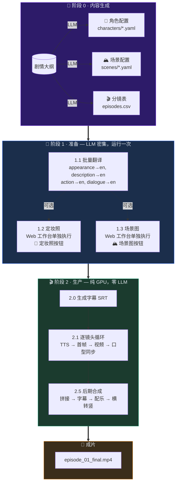

---

## 阶段 0 · 内容生成（可选）

> 从大纲自动生成角色、场景、分镜。已有素材可跳过。

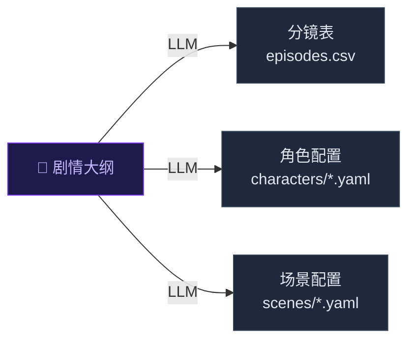

| 命令 | 功能 | 依赖 |
|------|------|------|
| `drama generate storyboard 1 -o outline.txt` | 从大纲生成分镜表 | LLM |
| `drama generate characters -d "22岁温柔女生" -d "25岁帅气男生"` | 从描述生成角色 | LLM |
| `drama generate scenes -d "现代简约客厅" -d "繁华商业街"` | 从描述生成场景 | LLM |
| `drama generate all 1 -o outline.txt` | 一键全量生成 | LLM |

**产出文件：**
- `projects/<项目>/config/characters/*.yaml` — 角色配置
- `projects/<项目>/config/scenes/*.yaml` — 场景配置
- `projects/<项目>/storyboard/episodes.csv` — 分镜表

---

## 阶段 1 · 准备

> LLM 密集操作集中完成。运行一次后，生产管线 **零 LLM 调用**。

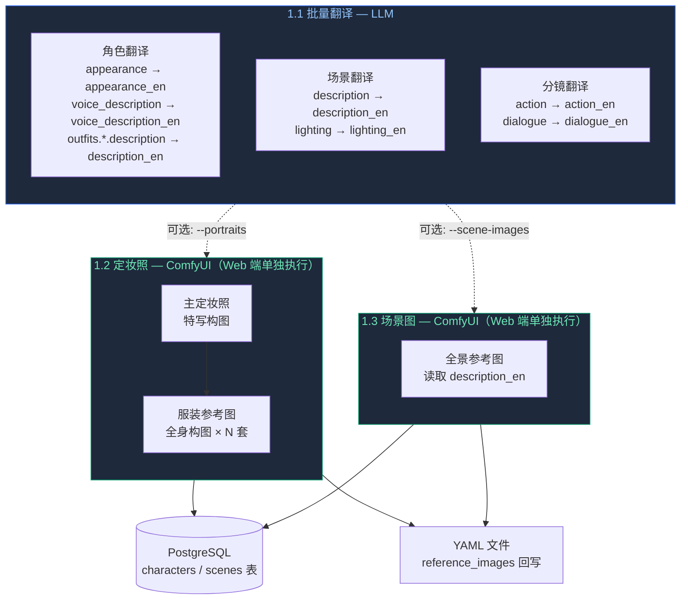

| 命令 | 功能 | 依赖 |
|------|------|------|
| `drama prepare 1` | 批量翻译 | LLM |
| `drama prepare 1 --no-translate` | 无翻译（空操作） | — |
| `drama prepare 1 --force` | 强制覆盖已有翻译 | LLM |

> 定妆照和场景图通过 Web 工作台「📸 定妆照」「🏔️ 场景图」单独执行，支持单角色/单场景按需生成。

### 翻译策略

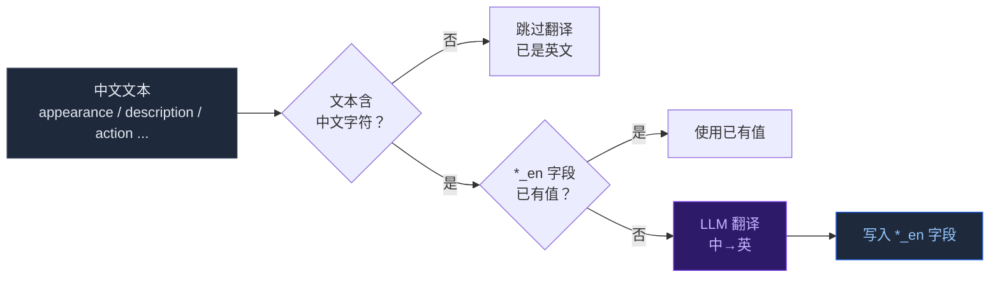

### 收益

| 场景 | 无 prepare | 有 prepare |
|------|-----------|-----------|
| 10 个镜头 | 30-40 次 LLM 调用 | **0 次** LLM 调用 |
| 生产速度 | 受 LLM 延迟限制 | **纯 GPU 全速** |

---

## 阶段 2 · 生产

> 纯 GPU/本地执行，零 LLM 调用。逐镜头完成 TTS → 首帧 → 视频 → 口型同步。

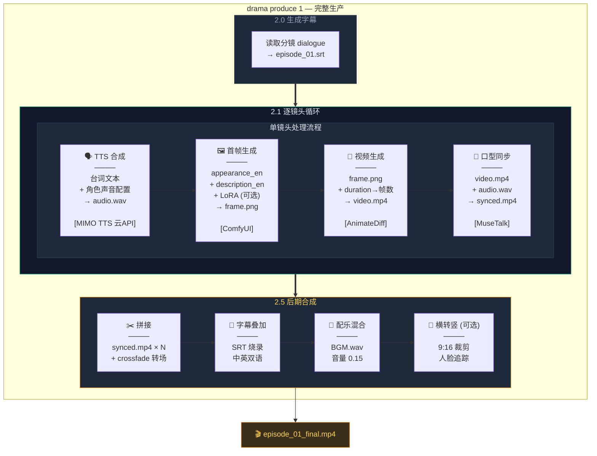

### 单镜头四步详解

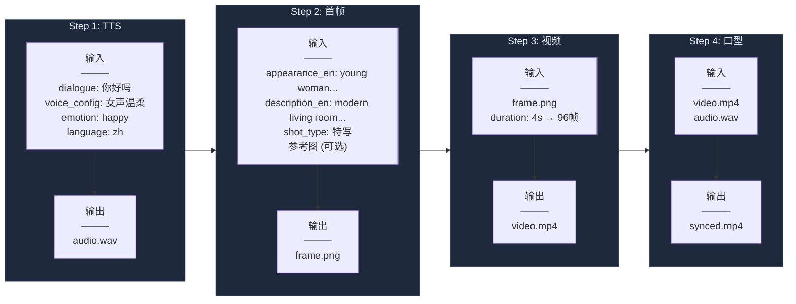

### produce 内部子步骤与进度

| 步骤 | 进度 | 说明 |
|------|------|------|
| 2.0 生成字幕 | 0-2% | 读分镜 dialogue → SRT 文件 |
| 2.1 逐镜头循环 | 5-85% | 每个镜头: TTS → 首帧 → 视频 → 口型 |
| 2.5 后期合成 | 90-100% | 拼接 → 字幕 → 配乐 → 横转竖 |

---

## 阶段 3 · 后期（独立命令）

> `drama post` 单独存在，用于**重做后期**而不重新生成镜头。

```mermaid
flowchart LR
    subgraph input["输入"]
        v1["s001/synced.mp4"]
        v2["s002/synced.mp4"]
        v3["s003/synced.mp4"]
        vn["sN/synced.mp4"]
        srt["episode_01.srt"]
        bgm["bgm.wav"]
    end

    subgraph process["处理流程"]
        direction LR
        concat["✂️ FFmpeg 拼接<br/>crossfade 转场<br/>transition_duration: 0.5s"]
        subtitle["📝 字幕叠加<br/>SRT 烧录到画面"]
        music["🎵 配乐混合<br/>BGM 音量 0.15"]
        vertical["📱 横转竖<br/>9:16 人脸追踪"]
        concat --> subtitle --> music --> vertical
    end

    subgraph output["输出"]
        final["episode_01_final.mp4"]
    end

    input --> process --> output

    style input fill:#1e293b,stroke:#334155,color:#94a3b8
    style process fill:#1e293b,stroke:#d97706,color:#fcd34d
    style output fill:#3b2e1b,stroke:#d97706,color:#fcd34d
```

| 命令 | 功能 |
|------|------|
| `drama post 1` | 后期合成（横屏） |
| `drama post 1 --vertical` | 后期合成 + 横转竖 |

---

## 命令对比

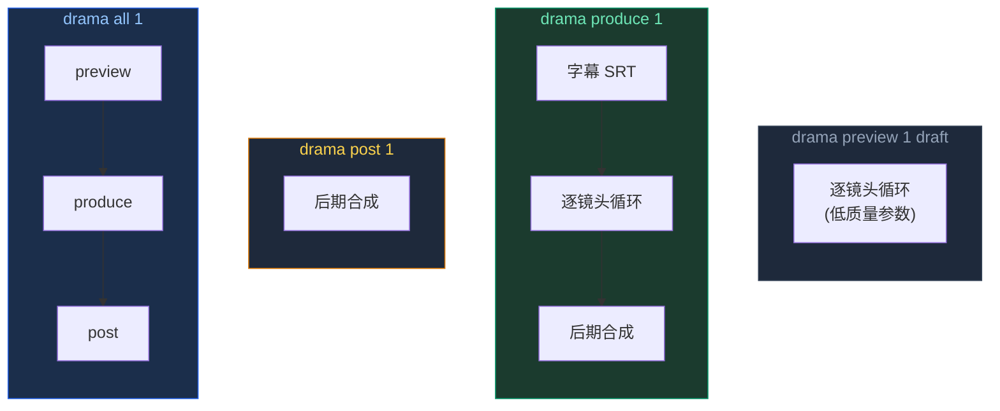

| 命令 | 字幕 | 镜头循环 | 后期合成 | 用途 |
|------|:----:|:--------:|:--------:|------|
| `drama preview 1 draft` | ❌ | ✅ 低质量 | ❌ | 快速预览效果 |
| `drama produce 1` | ✅ | ✅ 全质量 | ✅ | **完整生产** |
| `drama post 1` | ❌ | ❌ | ✅ | 重做后期（换配乐/加竖屏） |
| `drama all 1` | ✅ | ✅ | ✅ | 一键全流程 |

---

## 数据流全景

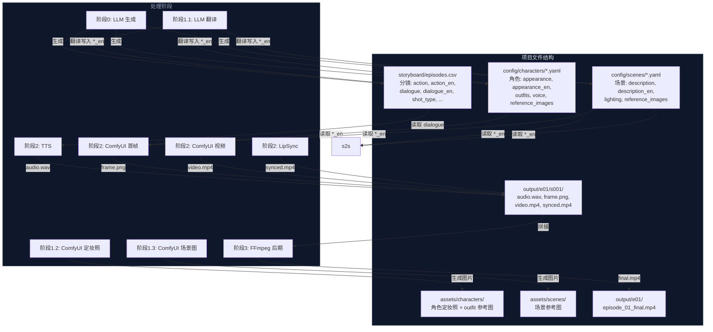

---

## 角色一致性 — IP-Adapter Plus

> 通过 `ip-adapter-plus-face` 模型实现跨镜头角色面部一致性

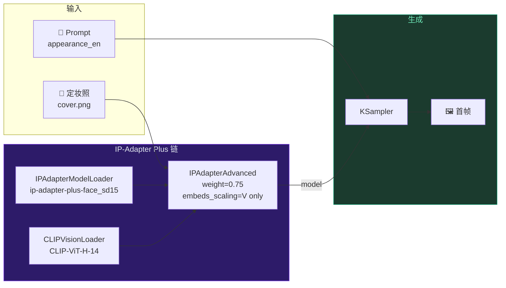

| 配置项 | 默认值 | 说明 |
|--------|--------|------|
| `ip_adapter.model` | `ip-adapter-plus-face_sd15.safetensors` | 面部一致性最佳 |
| `ip_adapter.weight` | `0.75` | 参考图影响力（0-1） |
| `ip_adapter.embeds_scaling` | `V only` | 面部特征保持最佳 |
| `ip_adapter.secondary_weight` | `0.45` | 多角色时次要角色权重 |

**模型选择建议**：
- 短剧角色（推荐）：`ip-adapter-plus-face_sd15` — 面部一致性最强
- 通用场景：`ip-adapter-plus_sd15` — 风格+内容保持
- SDXL：`ip-adapter-plus-face_sdxl_vit-h` — 高分辨率面部保持

**多角色同框**：自动链式注入，主角色 weight=0.75，次要角色 weight=0.45，确保各自面部特征不混淆。

**模型文件放置**：
```
ComfyUI/models/ipadapter/
  └── ip-adapter-plus-face_sd15.safetensors
ComfyUI/models/clip_vision/
  └── CLIP-ViT-H-14-laion2B-s32B-b79K.safetensors
```

---

## 服务依赖

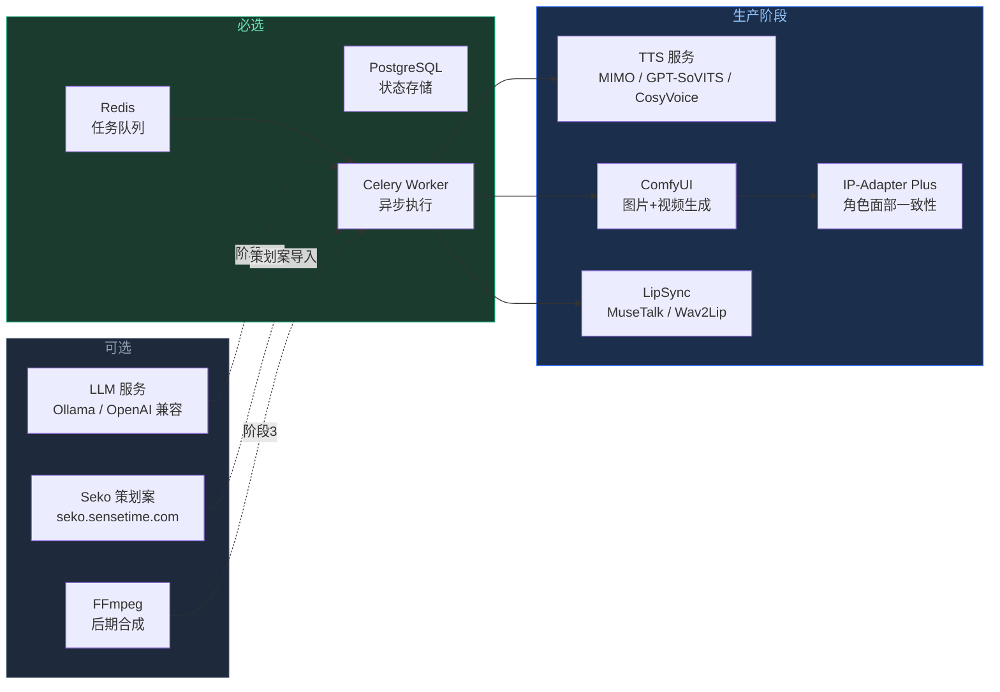

---

## 快速参考

```bash
# 首次使用
drama generate all 1 -o outline.txt    # 从大纲生成全部素材
drama prepare 1                        # 准备阶段（批量翻译）

# 日常生产
drama produce 1                        # 完整生产
drama produce 1 --vertical             # 完整生产 + 横转竖
drama produce 1 --force                # 强制重新生成

# 单独操作
drama preview 1 draft                  # 快速预览
drama post 1 --vertical                # 只做后期
drama portraits                        # 只生成定妆照

# 服务管理
drama serve                            # 启动 Web 工作台
drama worker                           # 启动 Celery Worker
drama status                           # 查看服务状态
```
